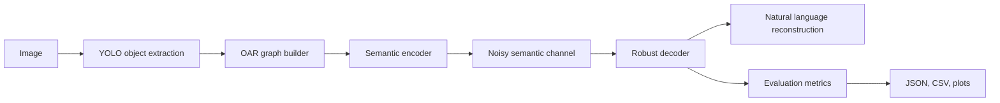

# Semantic Image Communication using OAR and AI-based Reconstruction

This project implements a modular semantic communication pipeline for **6G-oriented semantic image transmission**. It compresses object-attribute-relation (OAR) graphs into compact tokens, simulates semantic channel noise, reconstructs partial graphs robustly, and reports research-style metrics and plots.

## Pipeline



## What Changed

- Semantic payloads now use compact tokens instead of raw JSON.
- The channel can randomly drop objects and relations with a configurable noise level.
- The decoder repairs partial graphs and tolerates corrupted payloads.
- Evaluation now includes semantic score, compression ratio, image size, and noise tracking.
- Experiments sweep noise levels from `0.0` to `0.5` and export plots.

## Project Structure

```text
data/
	images/
src/
	__init__.py
	types.py
	extract.py
	oar_builder.py
	semantic_codec.py
	encoder.py
	channel.py
	decoder.py
	reconstruct.py
	evaluate.py
main.py
experiment.py
config.yaml
requirements.txt
results/
	semantic/
	text/
	logs/
	plots/
```

## Core Modules

- `src/extract.py`: YOLOv8-based object extraction.
- `src/oar_builder.py`: Rule-based OAR construction and spatial relations.
- `src/semantic_codec.py`: Compact token serialization and tolerant parsing.
- `src/encoder.py`: Semantic token encoding and bitrate estimation.
- `src/channel.py`: Random object and relation drop with reproducible seeds.
- `src/decoder.py`: Partial-graph reconstruction from noisy semantic payloads.
- `src/reconstruct.py`: Relation-aware natural language descriptions.
- `src/evaluate.py`: Semantic accuracy, compression metrics, and robustness summaries.
- `main.py`: Single-run end-to-end pipeline.
- `experiment.py`: Multi-image, multi-noise experiment runner with plots.

## Installation

```bash
pip install -r requirements.txt
```

Add images to `data/images/` before running the pipeline.

## Run the Pipeline

Default run:

```bash
python main.py
```

Override config values on the command line:

```bash
python main.py --noise-level 0.3 --max-objects 12 --seed 7 --no-enable-privacy
```

Use a different config file:

```bash
python main.py --config config.yaml
```

## Run Experiments

The experiment runner sweeps noise levels from `0.0` to `0.5` by default and stores aggregated results:

```bash
python experiment.py
```

Useful overrides:

```bash
python experiment.py --noise-start 0.0 --noise-stop 0.5 --noise-step 0.1 --max-images 20
```

## Configuration

`config.yaml` controls the default research setup:

```yaml
noise_level: 0.2
max_objects: 5
enable_privacy: true
```

Supported keys include:

- `image_dir`
- `results_dir`
- `model_path`
- `noise_level`
- `max_objects`
- `near_distance_threshold`
- `conf_threshold`
- `seed`
- `enable_privacy`

## Outputs

The pipeline writes outputs under `results/`:

- `results/semantic/<image_id>.json`: Per-image semantic trace.
- `results/text/<image_id>.txt`: Reconstructed text description.
- `results/dataset.json`: Dataset-style summary for downstream analysis.
- `results/evaluation_metrics.json`: Per-image metric records.
- `results/logs/pipeline.log`: Main pipeline log.
- `results/experiment_results.json`: Experiment summary and raw rows.
- `results/experiment_results.csv`: Experiment table.
- `results/plots/compression_vs_accuracy.png`: Compression ratio vs semantic score.
- `results/plots/noise_vs_semantic_score.png`: Noise robustness curve.

## Reproducing the Study

1. Install dependencies.
2. Place test images in `data/images/`.
3. Run `python main.py` for a single configuration.
4. Run `python experiment.py` to sweep noise levels.
5. Inspect the JSON, CSV, and plot outputs in `results/`.

## Example Reconstruction

For a partial scene with a person and a dog, the reconstructor may produce a description such as:

```text
The scene likely centers on people or human activity. This reconstructed scene appears to contain 2 objects: person (obj_0), dog (obj_1). Observed relations include person is near dog.
```

## Research Notes

- The semantic codec is intentionally compact and deterministic for reproducible experiments.
- The channel simulates semantic information loss rather than raw bit errors.
- The decoder keeps partial graphs valid so robustness can be measured instead of failing hard.
- You can replace the rule-based OAR builder with a learned relation model in future work.

