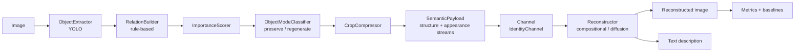

# AI-Enabled Multimedia Semantic Communication for Images

A modular semantic communication pipeline for **image transmission**. Instead of
sending raw pixels, the transmitter sends a compact **scene graph** plus
**compressed crops of only the important objects**; the receiver regenerates a
similar image and composites the received crops back at their locations, and
also emits a text description.

This is **v1 — prove the pipeline**. There is no lossy channel yet (only a
pass-through `IdentityChannel`), but every interface is designed so a real
wireless channel, learned models, and appearance embeddings drop in later
without changing callers. See [PLAN.md](PLAN.md) for the full design and the
TODO backlog.

## Pipeline


```mermaid
flowchart LR
    A[Image] --> B[ObjectExtractor<br/>YOLO]
    B --> C[RelationBuilder<br/>rule-based]
    C --> D[ImportanceScorer]
    D --> E[ObjectModeClassifier<br/>preserve / regenerate]
    E --> F[CropCompressor]
    F --> G[SemanticPayload<br/>structure + appearance streams]
    G --> H[Channel<br/>IdentityChannel]
    H --> I[Reconstructor<br/>compositional / diffusion]
    I --> J[Reconstructed image]
    I --> K[Text description]
    J --> L[Metrics + baselines]
```

**Key idea — per-object mode:**
- `regenerate`: ordinary objects; a similar-looking version is acceptable, so a
  low/medium-quality crop is sent.
- `preserve`: objects whose exact appearance must survive (text/documents,
  faces, logos). These are sent as a high-quality crop; text regions are also
  OCR'd and can be re-rendered crisply. Generative reconstruction is **never**
  applied to text regions.

## Two-stream payload (future-proofing)

The transmitted [`SemanticPayload`](src/payload.py) carries two
**independently-degradable** streams, each tagged with a `priority`
(0 = highest protection):

1. **structure stream** — the compact scene graph (object ids, classes, boxes,
   relations, per-object mode, OCR text, image size).
2. **appearance stream** — `object_id -> compressed crop bytes`.

Serialization is a length-prefixed binary container (no base64), so reported
byte sizes are the true on-wire sizes. A future `Channel` will corrupt the two
streams independently with unequal error protection — no caller changes needed.

## Module layout

```text
src/
  types.py            SceneObject, ObjectMode, Stream, Relation, OAR types
  extractors/         ObjectExtractor (base) + YoloExtractor + LearnedObjectExtractor
  relations/          RelationBuilder (base) + RuleBased + Learned (stub)
  importance.py       ImportanceScorer (base) + HeuristicImportanceScorer
  mode_classifier.py  ObjectModeClassifier (forced classes + OCR)
  ocr.py              OCR backend abstraction (easyocr / pytesseract / none)
  appearance/         AppearanceEncoder (base) + CropCompressor + EmbeddingEncoder (stub)
  payload.py          SemanticPayload (two streams) + binary (de)serialization
  channels/           Channel (base) + IdentityChannel
  reconstructors/     Reconstructor (base) + Compositional + Diffusion + text
  metrics.py          PSNR, downstream match, deep-feature*, LPIPS*, OCR legibility*
  baselines.py        JPEG-matched + text-only
  pipeline.py         SemanticPipeline orchestration + PipelineSettings
main.py               single run over a folder (image -> image + text + scene graph)
experiment.py         ExperimentRunner: configs + baselines + side-by-side images
scripts/train_detector.py   training skeleton for our own detector (P5)
tests/                unittest suite (payload, importance, mode, metrics)
```
`*` optional, behind a flag / graceful fallback when the dependency is absent.

Every model-bearing step lives behind a base class and is selected from config,
so a learned/alternative implementation can be swapped in without touching the
orchestration.

## Installation

```bash
pip install -r requirements.txt          # core CPU path
pip install -r requirements-extra.txt    # optional: OCR, LPIPS, diffusion, notebook
```

The core CPU path needs only `requirements.txt`. OCR (`easyocr`/`pytesseract`),
`lpips`, `diffusers`, and the analysis notebook deps are **optional** — the
pipeline runs without them and logs a warning when a feature is unavailable.

**Full setup, running, training, and GPU instructions: [docs/SETUP.md](docs/SETUP.md).**

## Run

Single run over `data/images/` (writes reconstructed images, text, scene graphs):

```bash
python main.py
```

Useful overrides (all config keys can also be set in `config.yaml`):

```bash
python main.py --extractor yolo --reconstructor compositional --max-objects 12 --seed 7
```

Experiment runner — every image through the semantic config + baselines, with a
results table and side-by-side comparison images:

```bash
python experiment.py                 # all images
python experiment.py --max-images 5  # subset
python experiment.py --deep-features # also compute VGG deep-feature distance
```

Run the tests:

```bash
python -m unittest discover -s tests
```

## Configuration (`config.yaml`)

| Key | Meaning |
|-----|---------|
| `extractor` | `yolo` (default) or `learned` (our detector; falls back to YOLO if no checkpoint) |
| `model_path` / `checkpoint_path` | YOLO weights / learned-detector checkpoint |
| `conf_threshold`, `max_objects` | detection thresholds |
| `relation_builder` | `rule_based` (default) or `learned` (stub) |
| `near_distance_threshold` | distance (px) for `near` / `interacting_with` relations |
| `importance.budget` | top-k objects sent as crops (default 3); preserve objects always sent |
| `preserve_classes` | classes forced to `preserve` mode (default `[person]`) |
| `ocr.enabled`, `ocr.backend` | OCR text detection (`auto`/`easyocr`/`pytesseract`/`none`) |
| `appearance.format` | crop container: `JPEG` or `WEBP` |
| `appearance.preserve_quality` / `regenerate_quality` | per-mode crop quality (95 / 35) |
| `streams.structure_priority` / `appearance_priority` | stream priorities (0 = highest) |
| `channel` | `identity` (only option in v1) |
| `reconstructor` | `compositional` (CPU default) or `diffusion` (flag-gated) |
| `background_color` | base canvas color for compositional reconstruction |
| `diffusion.enabled`, `diffusion.model_id` | enable GPU diffusion background (falls back to compositional) |
| `metrics.deep_features`, `metrics.lpips` | enable optional perceptual metrics |
| `seed` | reproducibility seed |

Legacy keys (`noise_level`, `enable_privacy`) are still accepted but unused by
the v1 image path (the channel is pass-through).

## Metrics & baselines

For each image the experiment runner reports, per method:

- **payload size** and **compression ratio** vs the raw image,
- **PSNR**,
- **downstream detector match** — re-run the detector on the reconstruction and
  compare detected classes/positions to the original (class recall + center error),
- optional **deep-feature cosine distance** (torchvision VGG), **LPIPS**, and
  **OCR legibility** for preserve-text objects.

Baselines: **JPEG at matched payload size** (apples-to-apples on bytes) and a
**text-only** reconstruction (no crops) — the latter shows that transmitting
crops actually improves downstream recovery.

## Outputs

```text
results/
  reconstructed/<id>.png    reconstructed image (main.py)
  text/<id>.txt             text description
  semantic/<id>.json        scene graph + payload size report
  dataset.json              per-image summary
  comparisons/<id>.png      original | semantic | text-only | jpeg side-by-side (experiment.py)
  experiment_results.csv    metrics table (one row per image x method)
  experiment_results.json   rows + per-method summary
  logs/                     pipeline / experiment logs
```

## Future work (scaffolded now — see PLAN.md and docs/SETUP.md §5–§7)

- **Wireless channel**: `AWGNChannel` / `RayleighChannel` with per-stream
  unequal error protection (the `Channel` base + priority-tagged streams are ready).
- **Learned relations**: train `LearnedRelationBuilder` (currently a stub).
- **Appearance embeddings**: finish `EmbeddingEncoder` (CLIP) to send embeddings
  instead of raw crops.
- **Own detector**: implement `scripts/train_detector.py`; `LearnedObjectExtractor`
  loads the checkpoint if present, else falls back to YOLO.
- **Diffusion background**: enable `DiffusionReconstructor` on GPU.
